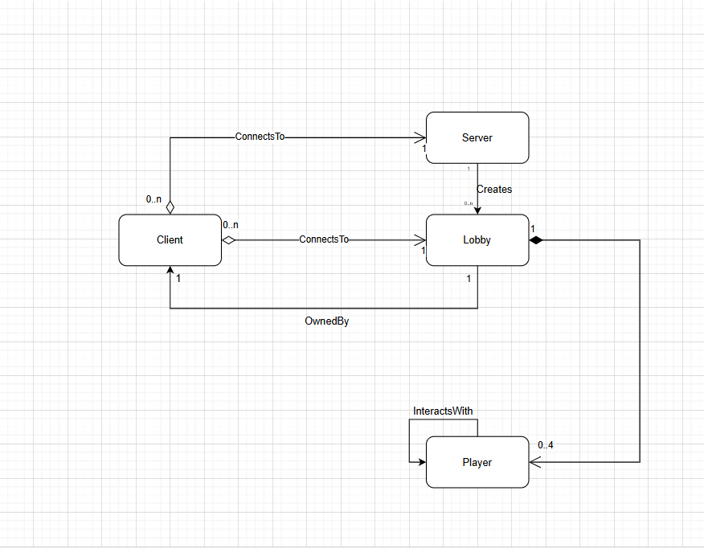

# Dubito Online

- [Alberto Arduini](mailto:alberto.arduini3@studio.unibo.it)
- [Andrea Bianchi](mailto:andrea.bianchi10@studio.unibo.it)

### AI Disclaimer (if needed)

```
"During the preparation of this work, the author(s) used Claude.Ai to generate small 
pieces of code to develop the Game Board for Dubito Online. This was used to help speeding up the development
of methods such as how to properly rotate game card buttons in the GUI and how to deactivate certain
buttons in the code based on the developed logic.
After generating the initial prompt, the author(s) then reviewed and edited the
content as needed and take(s) full responsibility for the content of the
final report/artifact."
```

## Abstract

This project's objective is to recreate a version of the famous card game called "Dubito", following the rules and ideas of the videogames "Liar's Bar" and "Master Bluff". 

The game rules are the following:
- At the start of each round each player receives 5 cards and a specific type of card is declared (Kings, Queens, Aces);
- Players during their turn can do one of the following actions:
    - Discard up to 3 cards from their hand facedown, those being of the same type that was declared at the start of the round or not. 
    - Call the previous player "liar", if the player is not the first one playing in the round.
- When a player calls for a lie, the cards that were discarded are shown and 2 possible scenarios may occur:
    - If that player did lie, the lying player loses 1 life.
    - If that player did not lie, the one who called for the bluff loses 1 life.
- Each player starts with 2 lives, and the last remaining living player is declared the winner.

## Concept

### Artifacts
The project will result in a *group* of applications that will let the users host, join and play games of dubito with other users.

The complete work is comprised of two applications:
- The LobbyServer, a CLI application that will host a server where users can connect to create and join lobbies;
- The GameApp, a Swing graphical application that the users can use to connect to a LobbyServer where they can play the game.

### Interactions and use cases
All users will be able to:
- Use the application to create or find a game to play with other users;
- Participate in a game by doing the actions expressed in the rules.

Additionally, users who create games will become those lobbies' *owners*, which will give them additional funcionality to manage the game(s) they create.

## Requirements

- Requirements are divided into:
    - **Functional**: some functionality the software should provide to the user
    - **Non-functional**: requirements that do not directly concern behavioural aspects, such as consistency, availability, etc.
    - **Implementation**: constrain the entire phase of system realization, for instance by requiring the use of a specific programming language and/or a specific software tool
        + these constraints should be adequately justified by political / economic / administrative reasons...
        + ... otherwise, implementation choices should emerge _as a consequence of_ design

- If there are domain-specific terms, these should be explained in a glossary

- Each requirement must have its own __acceptance criteria__
    + these will be important for the validation phase

---

The following sections group the system requirements by type and by domain functionality.
Each requirement will be followed by its own acceptance criteria(s).

### 1. Functional

#### 1.1 Lobby Management

- 1.1.1: The app must let an user see available lobbies created by other users.
    - The user must be able to see a list of all lobbies with their name, an indicator if the lobby is password protected and the number of users in the lobby.
- 1.1.2: The app must let an user join an existing lobby, even if password-protected, while it is not in a lobby.
    - The user must be able to join a lobby from the list (see Req. 1.1.1) if the lobby has not reached the maximum number of participants.
    - If the lobby is password protected the app must prompt the user for the password. 
    - When an user succesfully joins a lobby, all other users should be notifyed of the updated participant count for the lobby.
    - The funtionality must be available only when the user is not in a lobby already.
    - The user must not be able to join multiple lobbies concurrently.
- 1.1.3: The app must let an user create a new lobby, while the user is not in a lobby.
    - The user must be able create a new lobby that other users will be able to see and join.
    - The funtionality must be available only when the user is not in a lobby already.
    - When a user creates a lobby, it becomes also it's owner.
    - The user can't be whe owner of multiple lobbies concurrently.
- 1.1.4: The app must let a lobby owner set the lobby name and password.
    - The the lobby owner must be able to insert or change the lobby name and the password.
    - The name must not be empty, while the password *may* be empty.
    - When the changes are applied, all other users (both in the lobby and outside) must receive the updated information.
- 1.1.5: The app must let a user that is in a lobby leave it.
    - The app must let a user exit from the lobby it is in, notifying all other users of the updated user count for the lobby.
    - The funtionality must be available only when the user is in a lobby.
- 1.1.6: The app must let the lobby owner delete its lobby.
    - The lobby owner must be able to delete its lobby, notifying all users that the lobby doesn't exist anymore and kicking out the users who where in the lobby.
- 1.1.7: The app must let the lobby owner start the game with all the lobby users as participants.
    - The app must let the lobby owner start a game match where the users that are in the lobby become players in the game.
    - Also, no more players must be able to join the lobby.
- 1.1.8: The app must show, when an user is in a lobby, the other participants.
    - The user must be able to see a list of all the participants in the lobby it is currently in, with their name.
    - The app *may* emphasize who is the local user and who is the lobby owner.

#### 1.2 Gameplay

- 1.2.1: The app must let every player know which cards they have in their hand and what's the current round card value.
    - The user must be able to see *only* their hand and the cards that comprise it, without having the ability to see other players' hands.
    - The app *must* clearly show the current round card value so that players may know which of their cards can be discarded safely.
- 1.2.2: The app must let each player discard a variable amount of cards from their hand.
    - During their turn, a player must be capable of selecting up to 3 cards from their hand that can then be discarded with the press of a button or a key.
    - The app must notify every other users how many cards the turn player has discarded.
- 1.2.3: The app must let each player "call a lie" if they believe the previous player has not played cards that are of the same type as the declared one for the current round
    - During their turn, if a previous player has discarded some cards, the player may press a button or key to call the previous player a liar.
    - The app must then notify every player if the player has made a bluff (lied) or not, removing 1 life from the lying player or the one who called the bluff if he was wrong.
    - The app must start a new round after this event, giving a new random hand to each player and declaring a new card type for the new round.
- 1.2.4: The game must start a new round if no players calls for a lie.
    - If every player decides to only discard cards without anyone calling for a possible lie, the app must then start a new round.
- 1.2.4: The game can only be considered completed if only one player remains.
    - When a player loses all their lives, they are out of the game and will not receive new cards or be part of the turn order for the next rounds.
    - The player must be capable of leaving the current lobby once they are considered dead.
    - When every player except one dies, the last alive player is considered the game's winner, notifying each player of their success.
- 1.2.5: The game must continue working correctly if a player leaves the game early.
    - The app must continue the turn order if one player (the current one or not) disconnects from the lobby, letting the game continue as normal.
    - If only one player remains and all the others disconnect, the remaining player must be declared the winner of the game.
#### 1.3 Miscellaneous

- 1.3.1 The app must let a user set its display name.
    - The user must be able to set a name that will be shown to other users.
    - No restriction should be applied if the name is alreday used, so two users can have the same name.

### 2. Non-functional

- 2.1: The lobby management should not have network partition protection systems in place.
    - If the lobby management system has network problems or is not available, then the users can not access it.
    - By consequence, if a single user loses connection to the lobby management system, it's the user responsibility to find the issue.
- 2.2: The lobby management must provide always consistency and correctness of data.
    - The information the users receve from the lobby management system must always be corrent and up-to-date, taking into account network delays.
- 2.3: The game management should not have network partition protection systems in place.
    - If a users loses connection to the game, he won't be able to connect back.
- 2.4: The game management should notify each player of other users' actions in a consistent manner, while still keeping a certain level of availability.
    - When a player discards a certain amount of cards, even players that are not immediately after them in the turn order should be notified of the game change that occurred.
    - When a new round starts, each player must have their UI updated *when it's their turn* (they must have the most recent and updated view of the game).

### 3. Implementation

- 3.1: The application(s) will be developed using the Java language and the Swing framework, since they are what the development team are most familiar with.
- 3.2: The network management will be implemented from scratch, so that the behaviour of the applications can be controlled more precisely.

## Design

This chapter explains the strategies used to meet the requirements identified in the analysis, describing its architecture,
infrastructure and important aspects that will later be expanded in the implementation.


### Architecture

The project follows the MVC architecture to develop its main logic and program.

Focusing on the distributed part, the project is divided into 2 main different parts, each focusing on one specific aspect of the previously established requirements:
- The lobby system was developed following the **client-server architecture**, one of the most typical distributed application structure. This allowed us to partition tasks/workloads 
between the providers of a resource or service (the server lobby) and the service requesters (the user clients). Clients and servers exchange messages in a request–response messaging pattern:
each user may make one or multiple specific requests, after which servers provide the user clients with the necessary functions/services in order to satisfy the user's request. That includes: accessing any currently 
available lobbies, create new ones, set their own username, start a new game. The server can also receive and handle requests from many distinct clients in a short period, with a certain limit. Server relies on a scheduling 
system to prioritize incoming requests from clients to accommodate them. Also, servers provide encryption of lobbies using a simple password system to protect certain lobbies;
- The main game establishes communications between each user using **Peer-To-Peer (P2P)**. A peer-to-peer network is designed around the notion of *equal peer nodes* simultaneously functioning 
as both "clients" and "servers" to the other nodes on the network. Each in-game user, along with remaining connected to the lobby server, also becomes a peer.
Each player can then send messages/resources based on their in-game actions (discarding cards, calling liar), without requiring the usage 
of a central coordination system when updating the game state after each actions.

The project overall primarily follows the **Transmission Control Protocol (TCP)**, one of the main protocols of the Internet protocol suite. TCP provides reliable, ordered, 
and error-checked delivery of a stream of data between applications running on hosts communicating via an IP network. This was chosen because users do not need to know the 
particular mechanisms for sending data to other players (in other words, TCP offers a certain level of *transparency*). We've also chosen TCP protocol since the lobby system and game application 
required more focus on *consistency*, making sure that each message sent by the system to its users would be correct, rather than focusing on its availabilty.


### Infrastructure
The project's infrastructure was developed and composed as such:

- Each player is considered a client. N players can connect to a server with specific IP address and port;
- Each player is capable of creating a lobby (either password-protected or not), containing up to a max of 4 players;
- Theoretically, multiple servers can be located on the same machine;
- At the practical and at testing level however, only one server was initialized on the machine. All clients were also run on the same machine for development and simplicity purposes.
  It was also tested that it's possible for clients to be distributed across the world as long as the
  leader’s firewall accepts connections from outside the network;
- When starting the game, server connects each player in a lobby to each other, creating a new P2P network;
- During game sessions, players interact with each other, acting both as clients and servers for each other;
- Communication is performed via *custom messaging system*, where multiple types of messages where developed for each possible event that would normally occur in the application
  (both for lobbies and in-game events);



- are there infrastructural components that need to be introduced? how many?
    * e.g. clients, servers, load balancers, caches, databases, message brokers, queues, workers, proxies, firewalls, CDNs, etc.
- how do components	_distribute_ over the network? _where_?
    * e.g. do servers / brokers / databases / etc. sit on the same machine? on the same network? on the same datacenter? on the same continent?

- how do components _find_ each other?
    * how to _name_ components?
    * e.g. DNS, _service discovery_, _load balancing_, _etc._

> Component diagrams are welcome here

### Modelling
There are 2 main files that act as the focal point for the distributed enhancements of the entire
project, those being `PeerNetworkImpl` and `PeerGraphNetwork`.
These classes utilize a series of smaller files which abstract the entire distributed mechanism for the project, 
which are:
- `PeerConnection` (main interface to create connections);
- `PeerConnectionReceiver` (helps users to receive connections and establish bounds);
- `PeerExchanger` (lets users exchange their Peer IDs between each other);
- `MessageHandler` (along `PeerConnection`, the most important class. It allows users to properly handle messages received by server or other users);
- `PeerEndPoint` (Used to keep track of connections that are being established but are not yet complete).

`PeerNetworkImpl` is an implementation of the `PeerNetwork` interface, acting as a more generic network to define a clear,
consistent connection between user and server. Along with that, its other main usage is to keep track and update the following information:
- current session between server and user;
- online players;
- open lobbies.

Meanwhile `PeerGraphNetwork` acts as a more specialized version of the `PeerNetworkImpl`, it's an
object that manages each connected peer's server end point, establishing a complex web of connections between user players.
Its main priorities are:
- keeping players connected to each other;
- update game state for each player, making sure that each player has a consistent and UP-TO-DATE view;
- handle possible user peer disconnect to allow remaining players to continue playing.

#### Entities
The domain entities are:

- Players;
- Servers;

#### Events
Domain events change depending whether the user is in game session or not:

- Before the game:
  * connects to server;
  * sets their username;
  * creates a lobby;
  * sets password for the lobby;
  * joins a lobby;
- After the game:
  * plays cards from his hand;
  * calls another player "liar".

- which __domain entities__ are there?
    * e.g. _users_, _products_, _orders_, _etc._

- how do _domain entities_ __map to__ _infrastructural components_?
    * e.g. state of a video game on central server, while inputs/representations on clients
    * e.g. where to store messages in an IM app? for how long?

- which __domain events__ are there?
    * e.g. _user registered_, _product added to cart_, _order placed_, _etc._

- which sorts of __messages__ are exchanged?
    * e.g. _commands_, _events_, _queries_, _etc._

- what information does the __state__ of the system comprehend
    * e.g. _users' data_, _products' data_, _orders' data_, _etc._

> Class diagram are welcome here

### Interaction
Almost all events that occur in-game require first an input from the user.
When a player is in a lobby:
1. user sends an input to the server, which is then serialized into a specific message depending on the button
 that was pressed;
2. server receives message and performs a specific action accordingly (changin username, creating a new lobby, attempting to join a lobby);
Once the game starts, events are handled differently:
1. player sends either a message declaring to have played some cards or that he's calling the previous player a liar;
2. other players receive said message and update their internal game state accordingly.


> Sequence diagrams are welcome here

### Behaviour

- how does _each_ component __behave__ individually (e.g. in _response_ to _events_ or messages)?
    * some components may be _stateful_, others _stateless_

- which components are in charge of updating the __state__ of the system? _when_? _how_?

> State diagrams are welcome here

### Data and Consistency Issues

- Is there any data that needs to be stored?
    * _what_ data? _where_? _why_?

- how should _persistent data_ be __stored__?
    * e.g. relations, documents, key-value, graph, etc.
    * why?

- Which components perform queries on the database?
    * _when_? _which_ queries? _why_?
    * concurrent read? concurrent write? why?

- Is there any data that needs to be shared between components?
    * _why_? _what_ data?

### Fault-Tolerance

- Is there any form of data __replication__ / federation / sharing?
    * _why_? _how_ does it work?

- Is there any __heart-beating__, __timeout__, __retry mechanism__?
    * _why_? _among_ which components? _how_ does it work?

- Is there any form of __error handling__?
    * _what_ happens when a component fails? _why_? _how_?

### Availability
In case of network partitioning, the system prioritizes consistency over availability. The main focus
of the project is making sure that the right clients enter the respective game session and that each
player receives the correct game state when it's their turn to play. In case a
client goes offline while in a lobby, a message is sent to other lobby users to notify them of that disconnection,
without any attempt performed to retry connecting to the lobby (the disconnected user must restart the application, connect to the
server and find the lobby once again, if it hasn't started the game). If a player disconnects during play session, the system still does not
try to reconnect said player, updating instead the other users' views by showing that the disconnected players has lost all its lives and is now considered
a loser and continuing the turn order as normal. If only one user remains in game while every other player has disconnected, that player is declared as the winner of the game.

- Is there any __caching__ mechanism?
    * _where_? _why_?

- Is there any form of __load balancing__?
    * _where_? _why_?

- In case of __network partitioning__, how does the system behave?
    * _why_? _how_?

### Security
Authentication is an optional action performed only during lobby creation. Whenever a user sets a new lobby, it can decide
to add an extra form of authentication by establishing a lobby password. Whenever another user tries to join a protected
lobby, it is first sent to a new view where the system forces the user to input the correct password.
User written password is given to the server, who retrieves the lobby's password to compare the two. If they are the same, server
sends a JoinLobbyMessage to the owner and adds the new user to the lobby list (if it's not full). Otherwise, server sends to the new user
a JoinLobbyFailedMessage, asking for the user to retry inputting the correct password.
These passwords are not encrypted and are handled by server as simple strings.

- Is there any form of __authentication__?
    * _where_? _why_?

- Is there any form of __authorization__?
    * which sort of _access control_?
    * which sorts of users / _roles_? which _access rights_?

- Are __cryptographic schemas__ being used?
    * e.g. token verification, 
    * e.g. data encryption, etc.

--- 
<!-- Riparti da qui  -->

## Implementation

- which __network protocols__ to use?
    * e.g. UDP, TCP, HTTP, WebSockets, gRPC, XMPP, AMQP, MQTT, etc.
- how should _in-transit data_ be __represented__?
    * e.g. JSON, XML, YAML, Protocol Buffers, etc.
- how should _databases_ be __queried__?
    * e.g. SQL, NoSQL, etc.
- how should components be _authenticated_?
    * e.g. OAuth, JWT, etc.
- how should components be _authorized_?
    * e.g. RBAC, ABAC, etc.

### Technological details

- any particular _framework_ / _technology_ being exploited goes here

## Validation

### Automatic Testing
Components and important aspects of the project were unit-tested by creating simplified environment versions.
Tests are mainly divided into these sections:
- **Game Tests**
   * These were made to check the correct execution of the main game loop and interaction between game entities and "offline" players;
- **Utilities Tests**
   * Since many utilities where created for the project, a series of tests were made to check if they would correctly work in their required scenarios;
- **Message Tests**
   * Test environments were developed to analyze the many custom messages that were created for the project, their structure and how to potentially fix/enhance them;
   * Additional tests were created to see behaviour after sending or receiving a certain lobby or game message;
- **Lobby Tests**
   * These tests were focused on lobby's behaviour;
   * The purpose is testing the communication and interaction between clients and server while creating and updating lobbies;
   * Lobby connections are tested by ensuring the server has the correct amount of active players in the same lobby;
   * Lobby disconnection is tested by disconnecting one client and making sure the number of lobby players decreased;
- **Peer Tests**
   * These were developed to check user's behaviour during game sessions, where each player would turn into a peer 
   capable of communicating with other in-game players;
   * Focus points of these tests would be whether a peer would exchange messages, how the peer network would handle
   each update and making sure that each peer in the network would be UP-TO-DATE during their turn.


- how were individual components **_unit_-test**ed?
- how was communication, interaction, and/or integration among components tested?
- how to **_end-to-end_-test** the system?
    * e.g. production vs. test environment

- for each test specify:
    * rationale of individual tests
    * how were the test automated
    * how to run them
    * which requirement they are testing, if any

> recall that _deployment_ __automation__ is commonly used to _test_ the system in _production-like_ environment

> recall to test corner cases (crashes, errors, etc.)

### Acceptance test
Manual testing was performed in order to:
- Analyze triggering of event messages due to player actions: since tons of actions are related
  to player interaction, it was deemed to be more intuitive to perform these tests manually;
- Check proper integration of lobby and game application: while not impossible to be automatically tested, we
  decided to perform manual testing for this section to see if the whole project would be able to properly create
  peer networks and functioning game sessions in a reasonable amount of time.

These manual tests where perform both on single and multiple machines, using Windows 11. 
The original game was also tested on Linux.

## Release

- how where components organized into _inter-dependant modules_ or just a single monolith?
    * provide a _dependency graph_ if possible

- were modules distributed as a _single archive_ or _multiple ones_?
    * why?

- how were archive versioned? 

- were archive _released_ onto some archive repository (e.g. Maven, PyPI, npm, etc.)?
    * how to _install_ them?

## Deployment

- should one install your software from scratch, how to do it?
    * provide instructions
    * provide expected outcomes

## User Guide

- how to use your software?
    * provide instructions
    * provide expected outcomes
    * provide screenshots if possible


## Self-evaluation

### Andrea Bianchi

### Alberto Arduini
- An individual section is required for each member of the group
- Each member must self-evaluate their work, listing the strengths and weaknesses of the product
- Each member must describe their role within the group as objectively as possible. 
It should be noted that each student is only responsible for their own section