# Dubito Online

- [Alberto Arduini](mailto:alberto.arduini3@studio.unibo.it)
- [Andrea Bianchi](mailto:andrea.bianchi10@studio.unibo.it)

### AI Disclaimer (if needed)

```
"During the preparation of this work, the author(s) used Claude.Ai to generate small 
pieces of code to develop the Game Board for Dubito Online. This was used to help speeding up the development
of methods such as how to properly rotate game card buttons in the GUI and how to deactivate certain
buttons in the code based on the developed logic.
After generating the initial prompt, the author(s) then reviewed and edited the
content as needed and take(s) full responsibility for the content of the
final report/artifact."
```

## Abstract

This project's objective is to recreate a version of the famous card game called "Dubito", following the rules and ideas of the videogames "Liar's Bar" and "Master Bluff". 

The game rules are the following:
- At the start of each round each player receives 5 cards and a specific type of card is declared (Kings, Queens, Aces);
- Players during their turn can do one of the following actions:
    - Discard up to 3 cards from their hand facedown, those being of the same type that was declared at the start of the round or not. 
    - Call the previous player "liar", if the player is not the first one playing in the round.
- When a player calls for a lie, the cards that were discarded are shown and 2 possible scenarios may occur:
    - If that player did lie, the lying player loses 1 life.
    - If that player did not lie, the one who called for the bluff loses 1 life.
- Each player starts with 2 lives, and the last remaining living player is declared the winner.

## Concept

### Artifacts
The project will result in a *group* of applications that will let the users host, join and play games of dubito with other users.

The complete work is comprised of two applications:
- The LobbyServer, a CLI application that will host a server where users can connect to create and join lobbies;
- The GameApp, a Swing graphical application that the users can use to connect to a LobbyServer where they can play the game.

### Interactions and use cases
All users will be able to:
- Use the application to create or find a game to play with other users;
- Participate in a game by doing the actions expressed in the rules.

Additionally, users who create games will become those lobbies' *owners*, which will give them additional funcionality to manage the game(s) they create.

## Requirements

The following sections group the system requirements by type and by domain functionality.
Each requirement will be followed by its own acceptance criteria(s).

### 1. Functional

#### 1.1 Lobby Management

- 1.1.1: The app must let an user see available lobbies created by other users.
    - The user must be able to see a list of all lobbies with their name, an indicator if the lobby is password protected and the number of users in the lobby.
- 1.1.2: The app must let an user join an existing lobby, even if password-protected, while it is not in a lobby.
    - The user must be able to join a lobby from the list (see Req. 1.1.1) if the lobby has not reached the maximum number of participants.
    - If the lobby is password protected the app must prompt the user for the password. 
    - When an user succesfully joins a lobby, all other users should be notifyed of the updated participant count for the lobby.
    - The funtionality must be available only when the user is not in a lobby already.
    - The user must not be able to join multiple lobbies concurrently.
- 1.1.3: The app must let an user create a new lobby, while the user is not in a lobby.
    - The user must be able create a new lobby that other users will be able to see and join.
    - The funtionality must be available only when the user is not in a lobby already.
    - When a user creates a lobby, it becomes also it's owner.
    - The user can't be whe owner of multiple lobbies concurrently.
- 1.1.4: The app must let a lobby owner set the lobby name and password.
    - The the lobby owner must be able to insert or change the lobby name and the password.
    - The name must not be empty, while the password *may* be empty.
    - When the changes are applied, all other users (both in the lobby and outside) must receive the updated information.
- 1.1.5: The app must let a user that is in a lobby leave it.
    - The app must let a user exit from the lobby it is in, notifying all other users of the updated user count for the lobby.
    - The funtionality must be available only when the user is in a lobby.
- 1.1.6: The app must let the lobby owner delete its lobby.
    - The lobby owner must be able to delete its lobby, notifying all users that the lobby doesn't exist anymore and kicking out the users who where in the lobby.
- 1.1.7: The app must let the lobby owner start the game with all the lobby users as participants.
    - The app must let the lobby owner start a game match where the users that are in the lobby become players in the game.
    - Also, no more players must be able to join the lobby.
- 1.1.8: The app must show, when an user is in a lobby, the other participants.
    - The user must be able to see a list of all the participants in the lobby it is currently in, with their name.
    - The app *may* emphasize who is the local user and who is the lobby owner.

#### 1.2 Gameplay

- 1.2.1: The app must let every player know which cards they have in their hand and what's the current round card value.
    - The user must be able to see *only* their hand and the cards that comprise it, without having the ability to see other players' hands.
    - The app must clearly show the current round card value so that players may know which of their cards can be discarded safely.
- 1.2.2: The app must let each player discard a variable amount of cards from their hand.
    - During their turn, a player must be capable of selecting up to 3 cards from their hand that can then be discarded with the press of a button or a key.
    - The app must notify every other users how many cards the turn player has discarded.
- 1.2.3: The app must let each player "call a lie" if they believe the previous player has not played cards that are of the same type as the declared one for the current round
    - During their turn, if a previous player has discarded some cards, the player may press a button or key to call the previous player a liar.
    - The app must then notify every player if the player has made a bluff (lied) or not, removing 1 life from the lying player or the one who called the bluff if he was wrong.
    - The app must start a new round after this event, giving a new random hand to each player and declaring a new card type for the new round.
- 1.2.4: The game must start a new round if no players calls for a lie.
    - If every player decides to only discard cards without anyone calling for a possible lie, the app must then start a new round.
- 1.2.4: The game can only be considered completed if only one player remains.
    - When a player loses all their lives, they are out of the game and will not receive new cards or be part of the turn order for the next rounds.
    - The player must be capable of leaving the current lobby once they are considered dead.
    - When every player except one dies, the last alive player is considered the game's winner, notifying each player of their success.
- 1.2.5: The game must continue working correctly if a player leaves the game early.
    - The app must continue the turn order if one player (the current one or not) disconnects from the lobby, letting the game continue as normal.
    - If only one player remains and all the others disconnect, the remaining player must be declared the winner of the game.
#### 1.3 Miscellaneous

- 1.3.1 The app must let a user set its display name.
    - The user must be able to set a name that will be shown to other users.
    - No restriction should be applied if the name is alreday used, so two users can have the same name.

### 2. Non-functional

- 2.1: The lobby management should not have network partition protection systems in place.
    - If the lobby management system has network problems or is not available, then the users can not access it.
    - By consequence, if a single user loses connection to the lobby management system, it's the user responsibility to connect back to it.
- 2.2: The lobby management must provide always consistency and correctness of data.
    - The information the users receve from the lobby management system must always be correct and up-to-date, taking into account network delays.
- 2.3: The game management should not have network partition protection systems in place.
    - If a users loses connection to the game, he won't be able to connect back.
- 2.4: The game management should notify each player of other users' actions in a consistent manner, while still keeping a certain level of availability.
    - When a player discards a certain amount of cards, even players that are not immediately after them in the turn order should be notified of the game change that occurred.
    - When a new round starts, each player must have their UI updated (they must have the most recent and updated view of the game).

### 3. Implementation

- 3.1: The application(s) will be developed using the Java language and the Swing framework, since they are what the development team are most familiar with.
- 3.2: The network management will be implemented from scratch, so that the behaviour of the applications can be controlled more precisely.

## Design

This chapter explains the strategies used to meet the requirements identified in the analysis, describing its architecture, infrastructure and important aspects that will later be expanded in the implementation.

### Architecture

The project follows the MVC architecture to develop its main logic and program.

Focusing on the distributed part, the project is divided into 2 main different parts, each focusing on one specific aspect of the previously established requirements:
- The lobby system was developed following the **client-server** achitecture, one of the most typical distributed application structure. This allowed us to partition tasks/workloads between the providers of a resource or service (the server lobby) and the service requesters (the user clients). Clients can request resources or operations to the server, and the server will respond with the required data. The server can also send unsolicited data to the clients, to notify when a change in the system has happened;
- The main game is, instead, build using a **Peer-To-Peer (P2P)** architecture. A peer-to-peer network is designed around the notion of *equal peer nodes* simultaneously functioning as both "clients" and "servers" to the other nodes on the network. Each in-game user, along with remaining connected to the lobby server, also becomes a peer.
Each player can then send resources or operation results based on their in-game actions (discarding cards, calling liar) to the other peers, without requiring the usage of a central coordination system when updating the game state after each actions.

### Infrastructure
The project's infrastructure was developed and composed as such:

- The distributed configuration is, usually, the following:
    - $[1,N]$ machines host the lobby server(s)
    - $[0,N]$ machines act as clients
- Each client can connect to a lobby server with its IP address and port;
- Each player is capable of creating a lobby (either password-protected or not), containing up to a max of $4$ players, where other players may join;
- When starting the game, the lobby owner player creates a new P2P network, while the lobby server sends to all other players in the lobby the owner's IP and port, so that they can connect to it;

```plantuml

```

*Diagram to show the infrastructure*

### Modelling
There are 2 main files that act as the focal point for the distributed enhancements of the entire project, those being `PeerNetworkImpl` and `PeerGraphNetwork`.
These classes utilize a series of smaller files which abstract the entire distributed mechanism for the project, 
which are:
- `PeerConnection` (main interface to create connections);
- `PeerConnectionReceiver` (helps users to receive connections and establish bounds);
- `PeerExchanger` (lets users exchange their Peer IDs between each other);
- `MessageHandler` (along `PeerConnection`, the most important class. It allows users to properly handle messages received by server or other users);
- `PeerEndPoint` (Used to keep track of connections that are being established but are not yet complete).

`PeerNetworkImpl` is an implementation of the `PeerNetwork` interface, acting as a more generic network to define a clear,
consistent connection between user and server. Along with that, its other main usage is to keep track and update the following information:
- current session between server and user;
- online players;
- open lobbies.

Meanwhile `PeerGraphNetwork` acts as a more specialized version of the `PeerNetworkImpl`, it's an
object that manages each connected peer's server end point, establishing a complex web of connections between user players.
Its main priorities are:
- keeping players connected to each other;
- update game state for each player, making sure that each player has a consistent and UP-TO-DATE view;
- handle possible user peer disconnect to allow remaining players to continue playing.

#### Entities
The domain entities are:

- Players;
- Servers;

#### Events
Domain events change depending whether the user is in game session or not:

- Before the game:
  * connects to server;
  * sets their username;
  * creates a lobby;
  * sets password for the lobby;
  * joins a lobby;
- After the game:
  * plays cards from his hand;
  * calls another player "liar".

- which __domain entities__ are there?
    * e.g. _users_, _products_, _orders_, _etc._

- how do _domain entities_ __map to__ _infrastructural components_?
    * e.g. state of a video game on central server, while inputs/representations on clients
    * e.g. where to store messages in an IM app? for how long?

- which __domain events__ are there?
    * e.g. _user registered_, _product added to cart_, _order placed_, _etc._

- which sorts of __messages__ are exchanged?
    * e.g. _commands_, _events_, _queries_, _etc._

- what information does the __state__ of the system comprehend
    * e.g. _users' data_, _products' data_, _orders' data_, _etc._

> Class diagram are welcome here

### Interaction
Almost all events that occur in-game require first an input from the user.
When a player is in a lobby:
1. user sends an input to the server, which is then serialized into a specific message depending on the button
 that was pressed;
2. server receives message and performs a specific action accordingly (changin username, creating a new lobby, attempting to join a lobby);
Once the game starts, events are handled differently:
1. player sends either a message declaring to have played some cards or that he's calling the previous player a liar;
2. other players receive said message and update their internal game state accordingly.

```plantuml
@startuml
participant User1 as U1
participant Server as S
participant UserServer as US
participant LobbyServer as LS
participant User2 as U2

Note over U1, U2: Phase 1: User 1 Setup

U1 ->S: Connect (WebSocket/TCP)
S -> US: Peer Connected
US -> US: Peer Added
US -> U1: Send Updated Connected Clients List
US -> U2: Send Updated Connected Clients List
US -> LS: Peer Added
LS -> U1: Send Lobby List

@enduml
```
*Application Startup and User Setup sequence diagram*
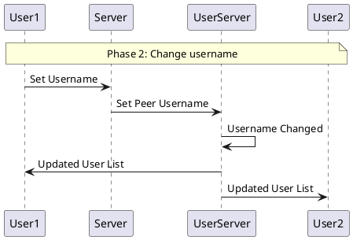
*change of username sequence diagram*
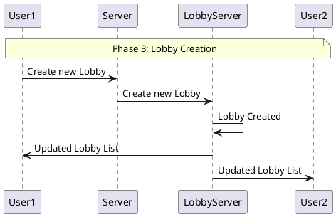
*Creation of new lobby sequence diagram*
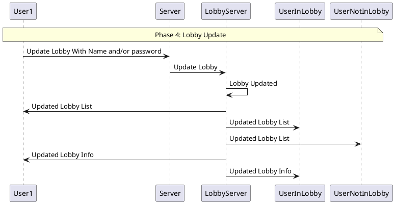
*update of lobby (either setting username or password) sequence diagram*
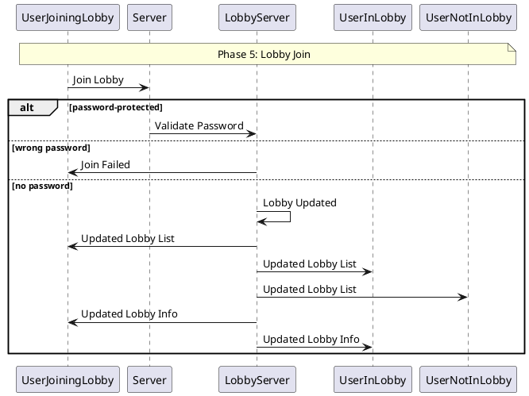
*Lobby Join sequence diagram*
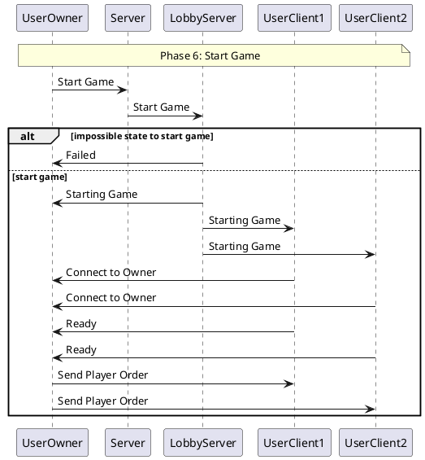
*start of game sequence diagram*
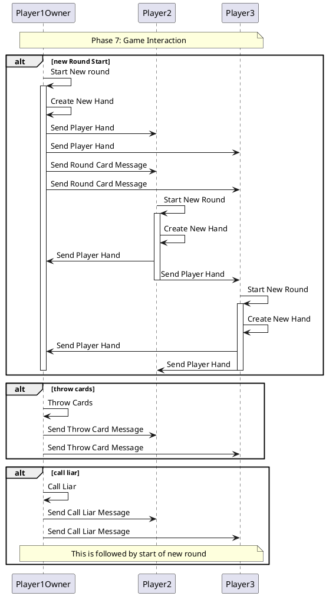
*in-game interaction sequence diagram*

### Behaviour

- how does _each_ component __behave__ individually (e.g. in _response_ to _events_ or messages)?
    * some components may be _stateful_, others _stateless_

- which components are in charge of updating the __state__ of the system? _when_? _how_?

> State diagrams are welcome here

### Data and Consistency Issues

All data in the system is *volatile*, meaning it does not need to be stored on disk or in a database.
For this reason all information is kept in memory by the lobby server(s), and it is lost when they are shutdown.
A representation of this data is sent to the clients, based on their status:
- Clients not in a lobby receive the lobby list, with only a subset of their information available;
- Clients in a lobby receive the full lobby information;
- All clients receive the full clients list.

### Fault-Tolerance

The system does not implement any fault-tolerance at the application layer, intstead it offloads it to the underlying network protocol. 
This was chosed since the requirements do not specify any kind or auto-reconnection or retry-mechanisms.

A partial fault-tolerance strategy may be to host multiple lobby servers on different machines.
This gives the users choice of connecting to a different server in case the one they wanted is not available.
Howerer, no data is shared between servers, so each server has an indipendent lobby list.
An improvement spot may be to use a shared, distributed database of lobbies, so that multiple servers can use the same lobby list.

### Availability

In case of network partitioning, as specified by the requirements, the system prioritizes consistency over availability.
This means that:
- In case a client goes offline while it is in a lobby, the lobby server removes them form the lobby, and the other lobby users are notified of the disconnection.
- If a non-owner client disconnects during a game session, the owner removes them from the game.
- If the owner client disconnects during a game session, the other clients perform a *host-migration*, where the next valid player becomes the game owner.

In any case, the system does not try to reconnect in case of a disconnection.

### Security

Clients are not authenticated by the system, since requirements do not specify it.

Authotization is optional and it is performed by the lobby server when a client tries to join a password protected lobby.
Whenever an user sets a new lobby, it can decide to set a lobby password. 
Whenever another user tries to join a protected lobby, it is required to send a password along with the join request.
If the passwords match, the user is added to the lobby (if it's not full). Otherwise, the server sends an error back to the client.
These passwords are not encrypted and are handled by the sytems as simple strings.

## Implementation

The project uses **Transmission Control Protocol (TCP)** as its netowrk protocol. We chose it instead of UDP since it fits best with our requirements: TCP provides reliable, ordered, and error-checked delivery of a stream of data between applications running on hosts communicating via an IP network, and since out use cases require more focus on *consistency* and *reliability* instead of fast delivery, this was the obvious choice.

The application data transmitted over the network is encoded using **JSON**. This was chosen both because of its maturity as a standard, which implies robust support from languages and libraries, and because of its ability to represent complex data without becoming too verbose.
We used the library **jackson** for serialization, because it had better support out of the box for handling inheritance of classes, which is used for the messages representation.

We have developed our **ad-hoc messaging protocol** in order to exchange data between users

### Technological details

- any particular _framework_ / _technology_ being exploited goes here

## Validation

### Automatic Testing
Components and important aspects of the project were unit-tested by creating simplified environment versions.
Tests are mainly divided into these sections:
- **Game Tests**
   * These were made to check the correct execution of the main game loop and interaction between game entities and "offline" players;
- **Utilities Tests**
   * Since many utilities where created for the project, a series of tests were made to check if they would correctly work in their required scenarios;
- **Message Tests**
   * Test environments were developed to analyze the many custom messages that were created for the project, their structure and how to potentially fix/enhance them;
   * Additional tests were created to see behaviour after sending or receiving a certain lobby or game message;
- **Lobby Tests**
   * These tests were focused on lobby's behaviour;
   * The purpose is testing the communication and interaction between clients and server while creating and updating lobbies;
   * Lobby connections are tested by ensuring the server has the correct amount of active players in the same lobby;
   * Lobby disconnection is tested by disconnecting one client and making sure the number of lobby players decreased;
- **Peer Tests**
   * These were developed to check user's behaviour during game sessions, where each player would turn into a peer 
   capable of communicating with other in-game players;
   * Focus points of these tests would be whether a peer would exchange messages, how the peer network would handle
   each update and making sure that each peer in the network would be UP-TO-DATE during their turn.

### Acceptance test
Manual testing was performed in order to:
- Analyze triggering of event messages due to player actions: since tons of actions are related
  to player interaction, it was deemed to be more intuitive to perform these tests manually;
- Check proper integration of lobby and game application: while not impossible to be automatically tested, we
  decided to perform manual testing for this section to see if the whole project would be able to properly create
  peer networks and functioning game sessions in a reasonable amount of time.

These manual tests where perform both on single and multiple machines, using Windows 11. 
The original game was also tested on Linux.

## Release

- how where components organized into _inter-dependant modules_ or just a single monolith?
    * provide a _dependency graph_ if possible

- were modules distributed as a _single archive_ or _multiple ones_?
    * why?

- how were archive versioned? 

- were archive _released_ onto some archive repository (e.g. Maven, PyPI, npm, etc.)?
    * how to _install_ them?

## Deployment
Project deployment was done following these instructions:
1. Build
   *
2. Start Server
   *
3. Start Game
   *

## User Guide

Here we have provided all the necessaries steps to play the game:
1. Launch at least one `LobbyServer` that users can later join into;
2. Launch the game: after clicking *Start* button, players will input the server IP address and port of the currently active server
   (default one has IP: 127.0.0.1, port: 9000);
   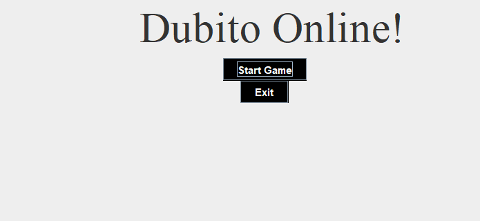
   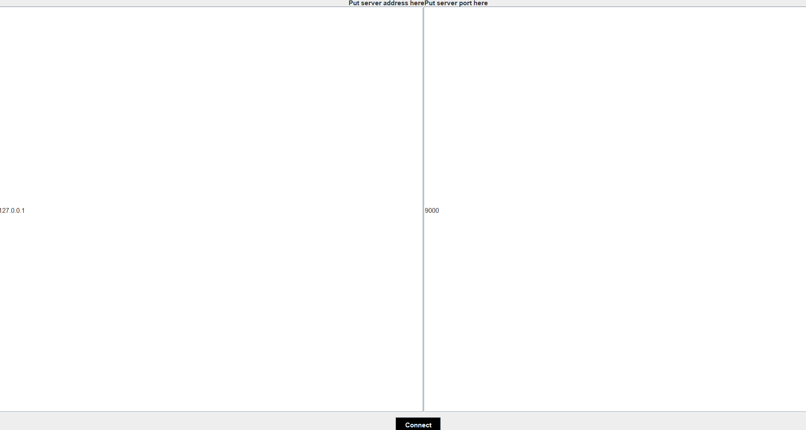
3. Once connected to the server, player can either set a new username at the bottom of the view;
4. **Lobby Creation**: user can click the *Create Lobby* button to set up a new lobby. Lobby is created with a new name and a possible password: the lobby will be shown to other players
   as soon as the owner of said lobby presses the *Save* button;
   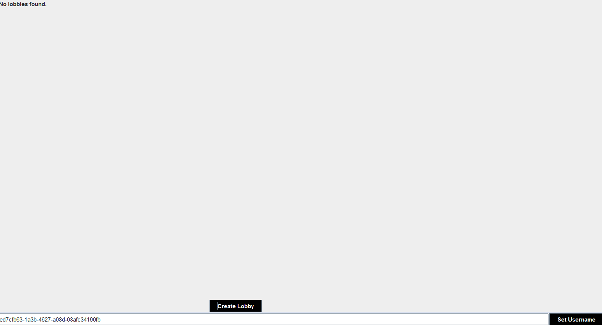
   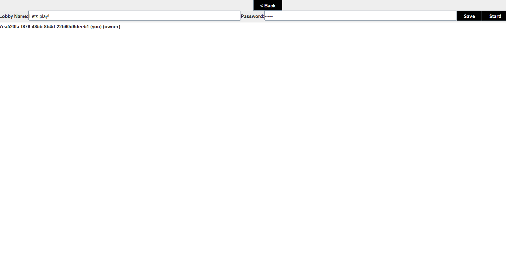
5. **Lobby Join**: users will see at the top of their view all currently available lobbies. Pressing the *Join* button near one of them to enter;
6. (Optional) If the lobby is password protected, users must first input the correct password in order to enter said lobby;
   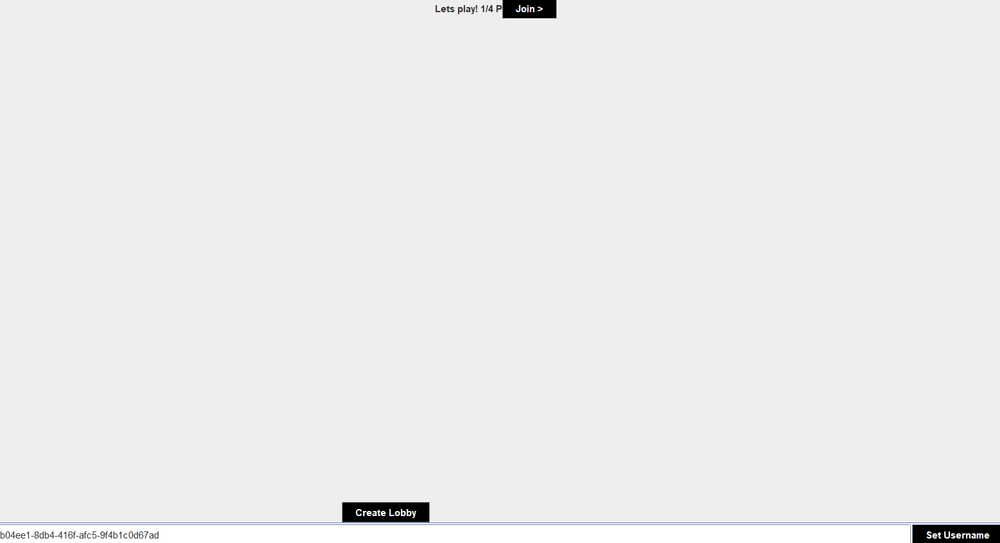
   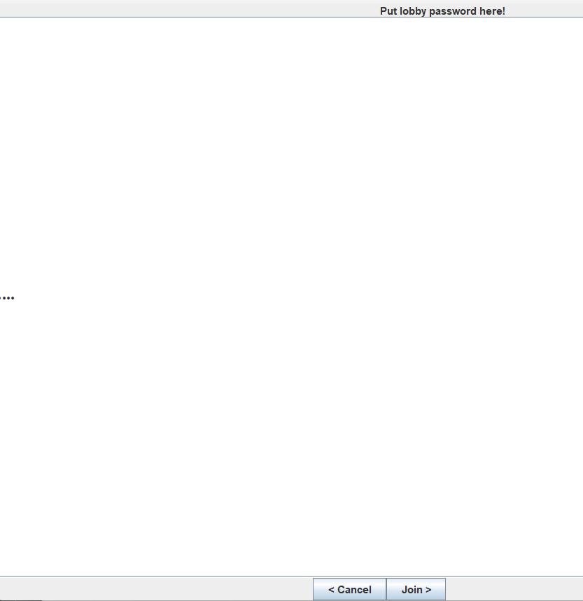
   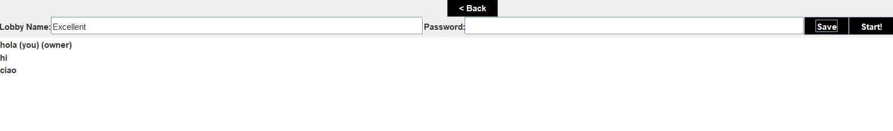
7. Lobby owner can press *Start* button in their view to start a new game session once there is at least one more user;
8. In game, players (in turn order) can either throw cards or call other players liar;
9. Game continues until only one player remains (in order to leave, they must close their window).
   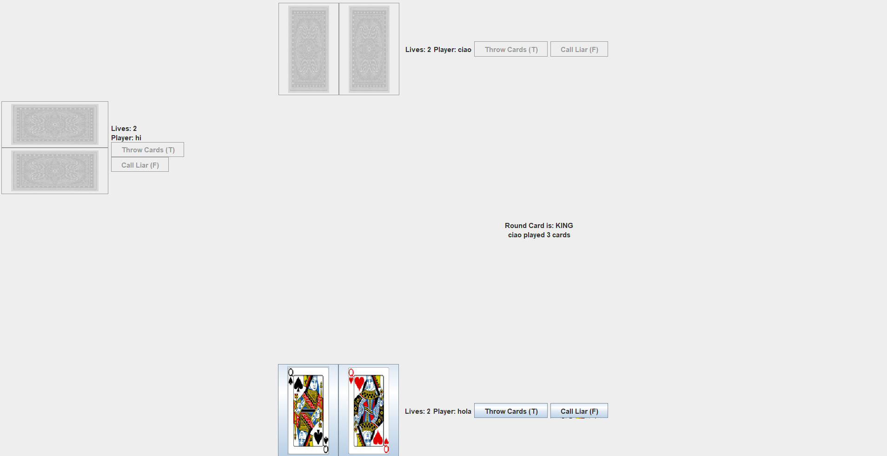
   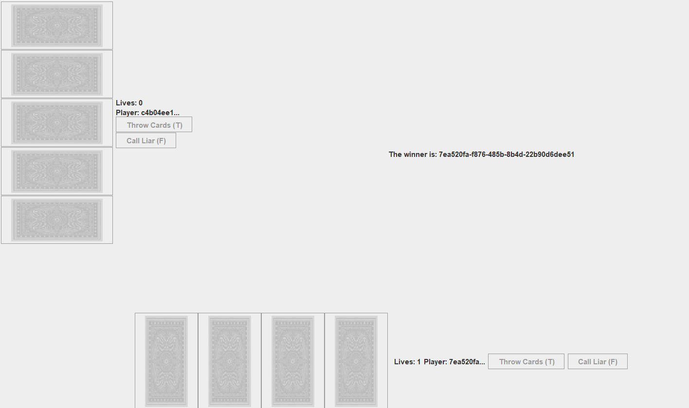


| Throw Cards | Call Liar |
|-------------|-----------|
| T           | F         |
*Table to showcase game key bindings*


## Self-evaluation

### Andrea Bianchi
While working on this project, i've discovered many interesting and peculiar findings on distributed systems
and how they operate. The work proved to be quite a challenging task, more than what we initially thought.
Both me and my colleague were quite busy with our everyday life, spending what we could of our free time studying and continuing
development for the project. Despite that, once everything started to "click", we've both felt a great sense of satisfaction and accomplishment.
The main strenghts of the project i feel are its quite intricate (yet easy to understand) messaging system, that allowed us to create fluid and consistent
interactions between each player (and between user and server while in lobby).
These strenghts came at quite the cost though: implementing our initial model design into a working system felt at first easy to apply, but we soon found out
many issues and bugs caused by message serialization (especially regarding key bindings) and the initial setup of P2P network for users in a lobby when starting the game.

Overall, i personally feel satisfied and i'm happy to have finally completed this long (but enjoyable) journey.
and the setup for the P2P network
### Alberto Arduini
- An individual section is required for each member of the group
- Each member must self-evaluate their work, listing the strengths and weaknesses of the product
- Each member must describe their role within the group as objectively as possible. 
It should be noted that each student is only responsible for their own section